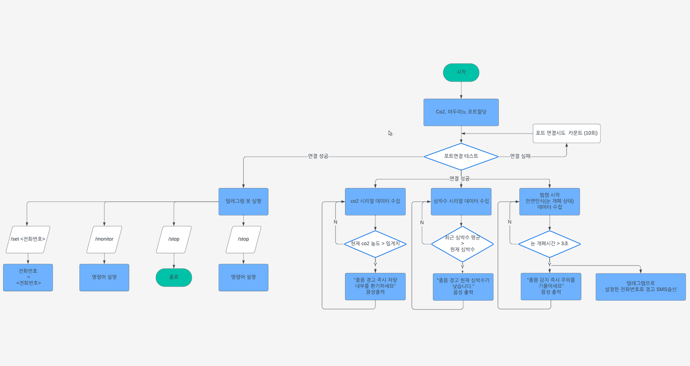

# 🚗FinalTest
###  무선네트워크 3조의 프로젝트입니다.  
 
- 라즈베리파이와 다양한 센서를 활용하여 졸음운전 감지 및 경고 시스템을 구축합니다. 이 프로젝트는 심박수, 이산화탄소(CO₂) 센서 데이터를 분석하고, dlib 라이브러리를 사용해 얼굴 특징을 실시간으로 추적하여 졸음운전을 탐지하며 경고합니다.
운전자의 졸음운전을 실시간으로 예측하고 운전자에게 경고하여 사고를 예방합니다.

<h1>🛠 프로젝트 개요</h1>

- 라즈베리파이(Raspberry Pi): 메인 프로세서로 센서와 카메라 모듈을 제어합니다. 
- 심박수 센서: 사용자의 심박 변화를 감지하여 피로를 추적합니다. 
- CO₂ 센서: 차량 내 이산화탄소 농도를 측정해 공기질 변화로 인한 졸음을 예측합니다. 
- dlib 라이브러리: 카메라를 통해 실시간으로 운전자의 졸음 여부를 판단합니다. 
- 쿨에스엠에스 API를 이용하여 설정된 전화번호로 SMS 전송합니다.

<h1>👥 팀원 및 기여도</h1>

|  이름  | 역할                   | 업무                                                                      |
| :----: |:---------------------|:------------------------------------------------------------------------|
| 강민범 | 심박수 측정 센서 제어         | -아두이노에서 심박 센서 값을 처리하여 라즈베리파이로 전달 -심박수 값이 일정 수치보다 아래면 경고음 출력          |
| 황지홍 | SMS 전송 및 텔레그램 봇      | -텔레그램 봇 API를 이용하여 전화번호를 설정하는 봇 구현 -쿨에스엠에스 API를 이용하여 설정된 전화번호로 SMS 전송 |
| 박시연 | 카메라를 이용한 실시간 졸음운전 감지 | -카메라를 이용한 실시간 눈 개폐 비율 확인 -개폐 비율이 임계값 이하로 일정시간 이상 지속될 경우 경고          |
| 이재맹 | 이산화탄소 농도 센서 제어       | -zigbee를 통한 이산화탄소 농도 값 처리 -이산화탄소 농도 값이 일정 수치보다 높으면 경고음 출력            |
| 강은규 | 시스템 통합 및 문서화         | -구현된 로직들 통합 -사업계획서 작성                                                |

 
## 🖼️ 시스템 흐름도

