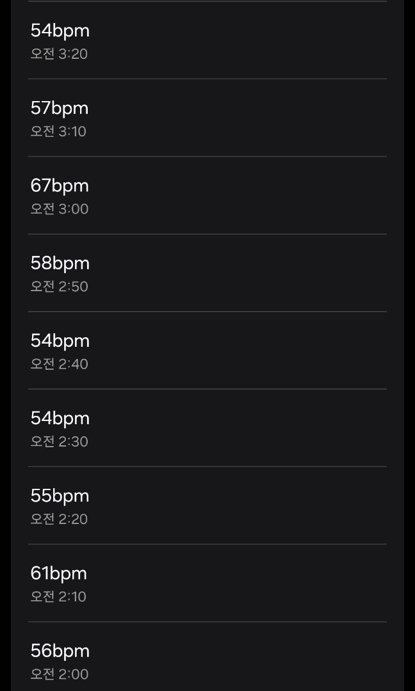

## 트러블 슈팅
1. 심박수 센서를 잡고 있지 않아도 심박수가 print 되는 현상 

   -> 아두이노에서 PulseSensorPlayground 라이브러리를 추가하여 테스트 
   
   -> 센서를 잡지 않으면 평균 성인의 심박수가 60~80인데 200 이상까지 측정되는 상황 발생 
    
   -> 심박수 센서가 문제가 있는 것 일까하여 다른 제품으로 바꿔 보았지만 같은 현상 발생  

   -> 심박으로 인식할 신호의 임계값이 너무 낮거나 높은 탓일까 임계값을 내려도 보고 올려도 보았지만 200 이상까지 측정  되었음.
   
   -> 다른 심박수 센서 2개를 교체하여 테스트 해보았지만 같은 상황 지속

# 심박수 센서를 이용한 졸음 운전 감지
심박수 센서를 통해 운전자의 심박수를 측정하고 평균 심박수보다 10bpm이 낮다면 운전자의 졸음 운전이 의심되기 때문에 SMS 경고 전송으로 졸음 운전을 방지합니다.


## 주요 기능
- 졸음운전 판단 기준
  - 심박수가 낮은 임계값(예: 55 bpm) 아래로 떨어지면 경고
  - 일정 시간 동안 심박수 변동이 작으면(예: 5 bpm 이하) 경고
  
- 졸음운전 상태 판단
  - 연속된 경고 횟수(WARNING_COUNT)를 기준으로 졸음운전을 판단
  
- 출력 및 알림
  - SMS 경고 메세지 전송

## 코드 설명
- **졸음운전 판단 기준 코드**
  - LOW_HEART_RATE : 수면 중 심박수를 측정한 결과 50~60bpm이 가장 많이 측정되어 그 중간 값으로 설정
  - CONSISTENT_THRESHOLD : 졸음 시 심박수의 변동 폭이 작기 때문에 측정 결과를 토대로 적절한 값 입력 
  - CHECK_INTERVAL : 경고를 너무 자주 발생시키면 운전자가 경고에 익숙해져 무시할 가능성이 있기 때문에 10초 간격으로 설정
  - WARNING_COUNT : 한 두번의 경고는 일시적인 심박수 변화일 수 있기 때문에 세 번 연속 경고가 발생하면 졸음 운전으로 판단
    ```python
      LOW_HEART_RATE = 55      # 낮은 심박수 임계값
      CONSISTENT_THRESHOLD = 5  # 변동 폭이 작다고 판단할 심박수 차이
      CHECK_INTERVAL = 10       # 검사 주기 (초)
      WARNING_COUNT = 3         # 연속 경고 발생 횟수 기준

- **졸음 운전 판단 코드**
    ```python
  def check_drowsiness(heart_rate_data):
    global warning_counter

    if len(heart_rate_data) < 2:
        return False  # 데이터가 충분하지 않으면 판단하지 않음

    # 평균 심박수 계산
    avg_heart_rate = sum(heart_rate_data) / len(heart_rate_data)

    # 심박수가 임계값 이하인지 확인
    if avg_heart_rate < LOW_HEART_RATE:
        warning_counter += 1
        print(f"경고: 심박수 낮음! 평균 심박수: {avg_heart_rate:.2f}")
    else:
        warning_counter = 0

    # 변동 폭이 작아 일정한 상태인지 확인
    max_hr = max(heart_rate_data)
    min_hr = min(heart_rate_data)
    if max_hr - min_hr < CONSISTENT_THRESHOLD:
        warning_counter += 1
        print("경고: 심박수 변동 없음!")

    # 연속 경고 발생 시 졸음 판단
    if warning_counter >= WARNING_COUNT:
        print("졸음운전 감지! 알림을 전송합니다.")
        warning_counter = 0
        return True

    return False

## 실행 방법

1. 라이브러리 설치
   - 필요한 라이브러리를 설치합니다:
     ```bash
     pip install pyserial
     ```

2. **장비 연결**
   -  심박수 센서를 아두이노와 연결합니다.
   - 아두이노를 pc usb포트에 연결합니다. 

# 문제 해결 과정
## 심박수 센서를 잡아도 심박수가 측정이 되는 문제 
- 코드가 문제일까? 싶어서 아두위키가 제공하는 심박수 센서 측정로 테스트
  - 심박수 센서를 잡을 때에만 심박수가 측정되지만 심박수가 비정상적으로 높게 측정됨

## 심박수 센서를 잡고 있어도 측정이 잘 되지 않는 문제
- 심박수가 잘 측정이 되지 않으니 심박수로 인식할 임계값을 낮추면 되지 않을까? 생각
  - 심박으로 인식하여 잘 측정이 되지만 여전히 심박수가 비정상적으로 높게 측정이 됨

## 심박수 센서가 비정상적으로 높게 측정이 되는 문제
- 심박수가 비정상적으로 측정이 되니 센서 기계의 문제가 아닐까 생각
  - 총 4개의 심박수 센서를 갖고 있었고 4개 모두 측정해본 결과 모두 동일하게 비정상적으로 높은 심박수가 측정이 되었음.
  
