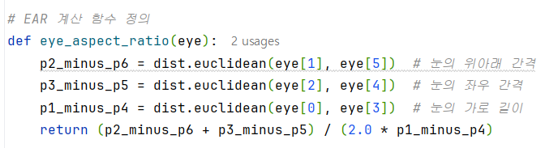
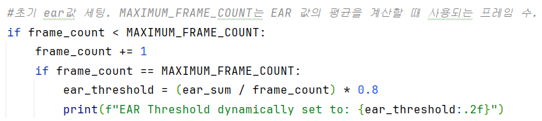
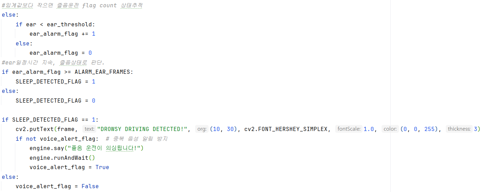

# 졸음운전 감지 시스템  

## 📌 프로젝트 개요
운전자가 졸음 상태일 때 카메라를 통해 실시간으로 경고를 제공하여 사고를 예방하는 시스템입니다. 눈 깜박임 비율(EAR)을 분석하여 졸음운전 여부를 감지하며, 음성 경고와 화면 메시지로 사용자에게 알림을 제공합니다.

---

## 🎯 주요 기능

### **1. EAR 기반 졸음운전 감지**
- **EAR(Eye Aspect Ratio)**: 눈의 열림/닫힘 상태를 실시간으로 계산.
- EAR 임계값을 동적으로 설정하여 개인의 눈 깜박임 패턴에 맞춘 경고 제공.

### **2. 실시간 얼굴 및 눈 추적**
- `dlib`의 68개 얼굴 랜드마크 모델을 활용하여 눈 영역을 추적.
- `OpenCV`를 이용해 실시간 카메라 영상 처리.


### **3. 경고 시스템**
- EAR 임계값 이하 상태가 지속되면 화면에 "DROWSY DRIVING DETECTED!" 메시지 출력.
- 음성 경고 중복 방지를 위한 플래그(`voice_alert_flag`) 사용.
- `pyttsx3` 라이브러리를 사용하여 졸음운전이 감지되면 음성으로 경고 메시지를 전달.


---

## 💡 핵심 기술

### **🌟 EAR 알고리즘**

- 눈의 위아래 거리와 좌우 거리를 기반으로 눈 개폐 정도를 계산.
- EAR 값이 낮으면 눈을 감은 상태로 판단.

### **🎯 Dlib**
- 얼굴 랜드마크 모델(`shape_predictor_68_face_landmarks.dat`)을 사용하여 눈 영역 추출.

### **📹 OpenCV**
- 웹캠으로부터 실시간 영상 데이터를 캡처하고, EAR 계산 및 경고 메시지 표시.

### **🔊 pyttsx3**
- 음성 합성 기능으로 "졸음운전이 의심됩니다!" 메시지를 사용자에게 전달.

### **📏 SciPy**
- 눈 영역의 유클리디안 거리를 계산하여 EAR 값을 정확히 측정.

---

## 🔑 핵심 코드 설명
- **EAR 계산** </br></br>
EAR(Eye Aspect Ratio)는 눈 개폐 정도를 나타내며, 수직 거리와 수평 거리 비율로 계산됩니다.
EAR 값이 낮아지면 눈이 감긴 것으로 간주합니다.



- **동적 임계값 설정**</br></br>
초기 프레임 동안 EAR 값을 누적하여 평균을 계산합니다.
평균 EAR 값의 80%를 임계값으로 설정하여, 개인화된 EAR 기준을 적용합니다.


- **졸음 감지**</br></br>
EAR 값이 동적으로 설정된 임계값보다 작아지면 졸음운전으로 감지합니다.
EAR 값이 연속적으로 일정 프레임 이상 지속되면 음성 및 시각적 경고를 출력합니다.



## 📍 실행 방법

### **1. 라이브러리 설치**

### 📍 **필요한 라이브러리 설치**

shape_predictor_68_face_landmarks.dat 파일을 다운로드해야 합니다. 이 파일은 dlib에서 제공하는 얼굴 랜드마크 모델입니다.
<br>
다운로드 링크: https://osdn.net/projects/sfnet_dclib/downloads/dlib/v18.10/shape_predictor_68_face_landmarks.dat.bz2/

```bash
pip install numpy opencv-python dlib imutils scipy pyttsx3
pip install cmake
pip install dlib

